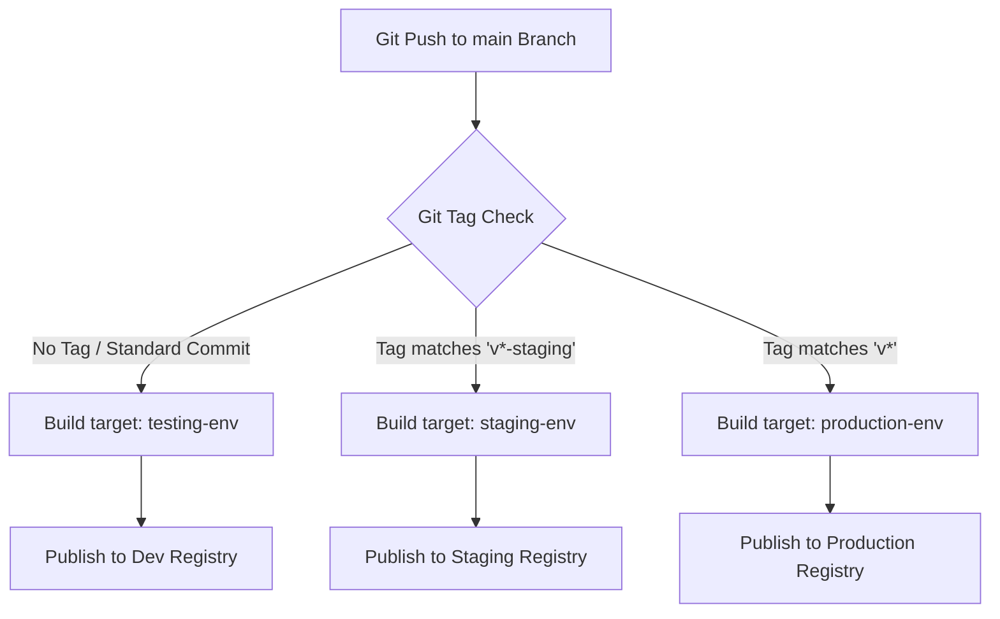

# Dynamic CI/CD Pipeline Orchestration

This skill translates Git Tag configurations into target container deployments to prevent manual configuration errors.

---

## 🛰️ Pipeline Tag Routing Logic

Our pipeline routes pushes on the `main` branch to specific container stages based on Git Tag signatures.

---

## 📝 Specifications

* **No Git Tag (Development/PR Check)**:
  * Targets `testing-env`.
  * Runs standard static analysis, test runs, and coverage verification.
* **Staging Promotion (`v*-staging`)**:
  * Targets `staging-env`.
  * Generates optimized build and mounts pre-prod configurations.
* **Production Release (`v*` e.g., `v1.2.3`)**:
  * Targets `production-env`.
  * Compiles high-performance container with strict production secrets injection.
